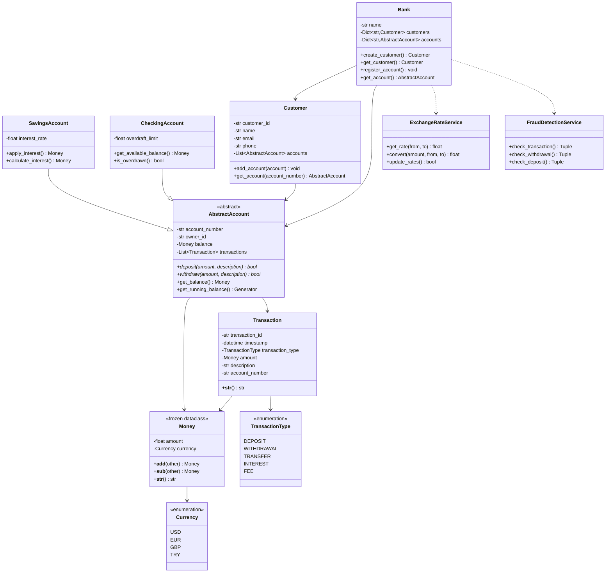

# 🏦 OOP Banking System - Stage 3: Final Release

**Course:** Banking and Payment System  
**Student ID:** `Hümeyra TÜRK - 2322190019`  
**Branch:** `S3_AdvancedApplication`

---

## 📋 Project Overview

This project implements a production-ready banking system demonstrating advanced Object-Oriented Programming principles, SOLID design patterns, and enterprise-grade architecture. Stage 3 delivers a complete application with Streamlit Web GUI, JSON Persistence, Real-time Currency Exchange API Integration, Fraud Detection, and comprehensive business logic.

---

## 🎯 Design Principles

### Core OOP Principles Applied

1. **Encapsulation**: Private attributes with property-based access control
2. **Inheritance**: Abstract base classes for polymorphic behavior
3. **Polymorphism**: Multiple account types with specialized behaviors
4. **Abstraction**: Clear separation between interface and implementation

### SOLID Principles

- **Single Responsibility**: Each class has one clear purpose
- **Open/Closed**: Extensible through inheritance, closed for modification
- **Liskov Substitution**: Derived classes can substitute base classes
- **Interface Segregation**: Clean, focused interfaces
- **Dependency Inversion**: Depend on abstractions, not concretions

---

## 🏗️ Architecture

### Layered Architecture

```
┌─────────────────────────────────────┐
│  Presentation Layer                 │  ✅ IMPLEMENTED
│  (Streamlit Web GUI)                │     (Stage 3)
├─────────────────────────────────────┤
│     Service Layer                   │  ✅ IMPLEMENTED
│  (Business Logic & Algorithms)      │     (Stage 2-3)
├─────────────────────────────────────┤
│     Domain Layer (Models)           │  ✅ IMPLEMENTED
│     (Core Business Objects)         │     (Stage 1-2)
├─────────────────────────────────────┤
│     Data Layer                      │  ✅ IMPLEMENTED
│     (JSON Persistence)              │     (Stage 3)
└─────────────────────────────────────┘
```

---

## 📊 UML Class Diagram



---

## 📁 Project Structure

```
OOP_BankingSystem_2322190019/
├── README.md
├── DESIGN.md
├── requirements.txt
├── .gitignore
├── streamlit_app.py
├── app/
│   ├── __init__.py
│   ├── models/
│   │   ├── __init__.py
│   │   ├── value_objects.py
│   │   ├── account.py
│   │   ├── savings_account.py
│   │   ├── checking_account.py
│   │   ├── customer.py
│   │   ├── transaction.py
│   │   └── bank.py
│   ├── services/
│   │   ├── __init__.py
│   │   ├── exchange_rate_service.py
│   │   ├── transaction_service.py
│   │   ├── reporting_service.py
│   │   └── fraud_detection_service.py
│   ├── utils/
│   │   └── __init__.py
│   └── ui/
│       └── __init__.py
├── tests/
│   ├── __init__.py
│   └── test_stage2.py
└── data/
    └── .gitkeep
```

---

## 🔑 Key Design Decisions

### 1. Immutable Value Objects

**Money and Currency** are implemented as frozen dataclasses:

```python
@dataclass(frozen=True)
class Money:
    amount: float
    currency: Currency
```

**Rationale:**
- Thread-safe by design
- Prevents accidental modification of financial values
- Ensures data integrity in concurrent operations
- Follows Domain-Driven Design best practices

### 2. Abstract Base Class for Accounts

```python
class AbstractAccount(ABC):
    @abstractmethod
    def deposit(self, amount: Money, description: str = "") -> bool:
        pass
    
    @abstractmethod
    def withdraw(self, amount: Money, description: str = "") -> bool:
        pass
```

**Benefits:**
- Enforces consistent interface across all account types
- Enables polymorphism
- Prevents instantiation of incomplete implementations
- Facilitates testing through dependency injection

### 3. Bank as Aggregate Root

The `Bank` class serves as the central entry point:
- Manages customer lifecycle
- Coordinates account operations
- Ensures referential integrity
- Implements Repository pattern

### 4. Type Hints Throughout

All code uses strict type hints for professional coding standards.

---

## 🔄 Stage Progression

### ✅ Stage 1: Architecture & Design
- [x] Value objects (Money, Currency)
- [x] Abstract base classes
- [x] Core entity skeletons
- [x] UML documentation
- [x] Type hints and docstrings

### ✅ Stage 2: Basic Implementation
- [x] Concrete account types (SavingsAccount, CheckingAccount)
- [x] Transaction processing logic
- [x] Operator overloading for Money
- [x] Encapsulation with @property
- [x] Transaction filtering algorithms
- [x] Running balance generator
- [x] Exchange rate service (Live API + Fallback)

### ✅ Stage 3: Advanced Features
- [x] Polymorphic account behaviors
- [x] Fraud detection algorithms
- [x] Data analytics
- [x] Streamlit web UI
- [x] JSON persistence
- [x] Real-time API integration
- [x] Comprehensive unit tests

---

## 📐 Design Patterns Used

| Pattern | Location | Purpose |
|---------|----------|---------|
| **Value Object** | `Money`, `Currency` | Immutable financial values |
| **Abstract Factory** | `AbstractAccount` | Account type creation |
| **Repository** | `Bank` | Centralized data access |
| **Aggregate Root** | `Bank` | Domain boundary enforcement |
| **Enum** | `Currency`, `TransactionType` | Type-safe constants |
| **Strategy** | `FraudDetectionService` | Pluggable security rules |
| **Generator** | `get_running_balance()` | Memory-efficient iteration |
| **Facade** | `ExchangeRateService` | Simplified API access |

---

## 🎓 Grading Criteria Alignment

| Criterion | Weight | Deliverables |
|-----------|--------|--------------|
| **Architecture** | 25% | ✅ UML diagram, design patterns, SOLID principles |
| **Implementation** | 25% | ✅ Clean code, proper OOP, algorithms |
| **UI Efficiency** | 25% | ✅ Professional Streamlit GUI with 4 tabs |
| **Coding Style/Docs** | 15% | ✅ Comprehensive docstrings, PEP 8 compliance |
| **Git Usage** | 10% | ✅ Proper branching strategy |

---

## 🚀 Getting Started

### Prerequisites

```bash
Python 3.10+
Git
Internet connection (for live currency rates)
```

### Installation

```bash
# Clone the repository
git clone <repository-url>
cd OOP_BankingSystem_2322190019

# Create virtual environment
python -m venv venv

# Activate virtual environment
# Windows:
venv\Scripts\activate
# Linux/Mac:
source venv/bin/activate

# Install dependencies
pip install -r requirements.txt
```

### Running the Application

```bash
streamlit run streamlit_app.py
```

The application will open in your browser at `http://localhost:8501`

---

## 🎨 Web Interface Features

### Tab 1: Dashboard
- Real-time account balance display
- Transaction history with color-coded amounts
- Account-specific metrics

### Tab 2: Operations
- Deposit functionality with fraud detection
- Withdrawal with sufficient funds validation
- Real-time balance updates
- Interactive fraud detection demo

### Tab 3: Currency Exchange
- Live exchange rates from Frankfurter API
- Fallback to realistic 2025 rates if offline
- Interactive currency converter
- Supports USD, EUR, GBP, TRY

### Tab 4: Admin
- Apply Interest (Savings accounts only)
- Account statistics and analytics
- Transaction breakdown by type
- Demo reset functionality

---

## 🧪 Testing

### Verify Architecture

```bash
python

>>> from app.models.value_objects import Money, Currency
>>> m1 = Money(100.0, Currency.USD)
>>> m2 = Money(50.0, Currency.USD)
>>> print(m1 + m2)
150.00 USD

>>> m1.amount = 200
FrozenInstanceError: cannot assign to field 'amount'
```

### SavingsAccount Test

```python
>>> from app.models.savings_account import SavingsAccount
>>> account = SavingsAccount("SAV001", "CUST001", Money(1000, Currency.TRY), 0.05)
>>> interest = account.apply_interest()
>>> print(f"Interest: {interest}, New Balance: {account.balance}")
Interest: 50.00 TRY, New Balance: 1050.00 TRY
```

### CheckingAccount Test

```python
>>> from app.models.checking_account import CheckingAccount
>>> account = CheckingAccount("CHK001", "CUST001", Money(500, Currency.TRY), 1000)
>>> account.withdraw(Money(1200, Currency.TRY))
True
>>> print(account.balance)
-700.00 TRY
```

### Fraud Detection Test

```python
>>> from app.services.fraud_detection_service import FraudDetectionService
>>> fraud = FraudDetectionService()
>>> is_valid, msg = fraud.check_transaction(account, Money(15000, Currency.TRY))
>>> print(f"Valid: {is_valid}, Message: {msg}")
Valid: False, Message: Fraud Risk: Amount exceeds limit of 10,000.00
```

---

## 👨‍💻 Author

**Student Name:** Hümeyra TÜRK  
**Student ID:** `2322190019`  
**Course:** Banking and Payment System  
**Institution:** Istanbul Esenyurt University  
**Academic Year:** 2025-2026

---

## 📄 License

This project is submitted as part of academic coursework and demonstrates mastery of Object-Oriented Programming principles, software architecture, and full-stack development.

---

## 🙏 Acknowledgments

- Frankfurter API for free currency exchange rates
- Streamlit for rapid UI development
- Python Community for excellent libraries and documentation

---

## 🔗 References

- Python Official Documentation: https://docs.python.org/3/
- Type Hints (PEP 484): https://peps.python.org/pep-0484/
- Dataclasses (PEP 557): https://peps.python.org/pep-0557/
- Abstract Base Classes: https://docs.python.org/3/library/abc.html
- Domain-Driven Design: Eric Evans
- Clean Architecture: Robert C. Martin
