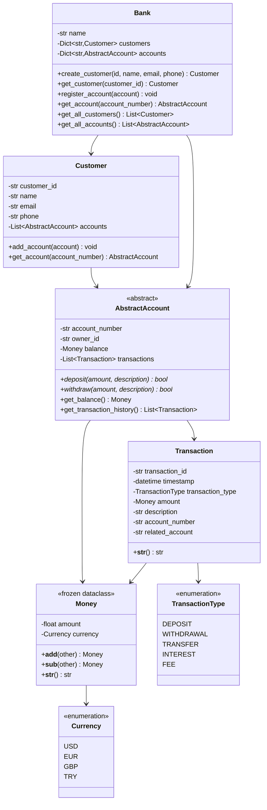

# 🏦 OOP Banking System - Stage 1: Architecture & Design

**Course:** Banking and Payment System  
**Student ID:** `Hümeyra TÜRK - 2322190019`  
**Branch:** `S1_Design`

---

## 📋 Project Overview

This project implements a production-ready banking system demonstrating advanced Object-Oriented Programming principles, SOLID design patterns, and enterprise-grade architecture. Stage 1 focuses on establishing a robust architectural foundation.

---

## 🎯 Design Principles

### Core OOP Principles Applied

1. **Encapsulation**: Private attributes with property-based access control
2. **Inheritance**: Abstract base classes for polymorphic behavior
3. **Polymorphism**: Multiple account types with specialized behaviors
4. **Abstraction**: Clear separation between interface and implementation

### SOLID Principles

- **Single Responsibility**: Each class has one clear purpose
- **Open/Closed**: Extensible through inheritance, closed for modification
- **Liskov Substitution**: Derived classes can substitute base classes
- **Interface Segregation**: Clean, focused interfaces
- **Dependency Inversion**: Depend on abstractions, not concretions

---

## 🏗️ Architecture

### Layered Architecture

```
┌─────────────────────────────────────┐
│     Presentation Layer (UI)         │  (Stage 3)
├─────────────────────────────────────┤
│     Service Layer                   │  (Stage 2-3)
│  (Business Logic & Algorithms)      │
├─────────────────────────────────────┤
│     Domain Layer (Models)           │  ← STAGE 1
│     (Core Business Objects)         │
├─────────────────────────────────────┤
│     Data Layer (Persistence)        │  (Stage 2-3)
└─────────────────────────────────────┘
```

---

## 📊 UML Class Diagram



---

## 📁 Project Structure

```
OOP_BankingSystem_<StudentID>/
├── README.md                    # This file
├── DESIGN.md                    # Detailed design specification
├── requirements.txt             # Python dependencies
├── .gitignore                   # Git ignore rules
├── app/
│   ├── __init__.py
│   ├── models/                  # ← STAGE 1: Core domain models
│   │   ├── __init__.py
│   │   ├── value_objects.py    # Money, Currency (immutable)
│   │   ├── account.py          # AbstractAccount (ABC)
│   │   ├── customer.py         # Customer entity
│   │   ├── transaction.py      # Transaction record
│   │   └── bank.py             # Bank aggregate root
│   ├── services/               # Stage 2: Business logic
│   │   └── __init__.py
│   ├── utils/                  # Stage 2: Helper functions
│   │   └── __init__.py
│   └── ui/                     # Stage 3: Streamlit UI
│       └── __init__.py
├── tests/                      # Unit tests
│   └── __init__.py
└── data/                       # JSON persistence
    └── .gitkeep
```

---

## 🔑 Key Design Decisions

### 1. Immutable Value Objects

**Money and Currency** are implemented as frozen dataclasses:

```python
@dataclass(frozen=True)
class Money:
    amount: float
    currency: Currency
```

**Rationale:**
- Thread-safe by design
- Prevents accidental modification of financial values
- Ensures data integrity in concurrent operations
- Follows Domain-Driven Design best practices

### 2. Abstract Base Class for Accounts

```python
class AbstractAccount(ABC):
    @abstractmethod
    def deposit(self, amount: Money, description: str = "") -> bool:
        pass
    
    @abstractmethod
    def withdraw(self, amount: Money, description: str = "") -> bool:
        pass
```

**Benefits:**
- Enforces consistent interface across all account types
- Enables polymorphism (SavingsAccount, CheckingAccount in Stage 2)
- Prevents instantiation of incomplete account implementations
- Facilitates testing through dependency injection

### 3. Bank as Aggregate Root

The `Bank` class serves as the central entry point:
- Manages customer lifecycle
- Coordinates account operations
- Ensures referential integrity
- Implements Repository pattern

### 4. Type Hints Throughout

All code uses strict type hints:
```python
def get_customer(self, customer_id: str) -> Optional[Customer]:
```

**Benefits:**
- IDE autocomplete support
- Early error detection with mypy
- Self-documenting code
- Professional coding standards

---

## 🔄 Stage Progression

### ✅ Stage 1 (Current): Architecture & Design
- [x] Value objects (Money, Currency)
- [x] Abstract base classes
- [x] Core entity skeletons
- [x] UML documentation
- [x] Type hints and docstrings

### ⏭️ Stage 2: Basic Implementation
- [ ] Concrete account types (SavingsAccount, CheckingAccount)
- [ ] Transaction processing logic
- [ ] Operator overloading for Money
- [ ] Encapsulation with @property
- [ ] Transaction filtering algorithms
- [ ] Running balance generator
- [ ] Exchange rate service

### ⏭️ Stage 3: Advanced Features
- [ ] Polymorphic account behaviors
- [ ] Fraud detection algorithms
- [ ] Data analytics (top accounts using heaps)
- [ ] Streamlit web UI
- [ ] JSON persistence
- [ ] Comprehensive unit tests

---

## 📐 Design Patterns Used

| Pattern | Location | Purpose |
|---------|----------|---------|
| **Value Object** | `Money`, `Currency` | Immutable financial values |
| **Abstract Factory** | `AbstractAccount` | Account type creation |
| **Repository** | `Bank` | Centralized data access |
| **Aggregate Root** | `Bank` | Domain boundary enforcement |
| **Enum** | `Currency`, `TransactionType` | Type-safe constants |

---

## 🎓 Grading Criteria Alignment

| Criterion | Weight | Stage 1 Deliverables |
|-----------|--------|---------------------|
| **Architecture** | 25% | ✅ UML diagram, design patterns, SOLID principles |
| **Implementation** | 25% | ✅ Clean code structure, proper OOP, type hints |
| **UI Efficiency** | 25% | ⏭️ Stage 3 |
| **Coding Style/Docs** | 15% | ✅ Comprehensive docstrings, PEP 8 compliance |
| **Git Usage** | 10% | ✅ Proper branching (S1_Design) |

---

## 🚀 Getting Started

### Prerequisites

```bash
Python 3.10+
Git
```

### Installation

```bash
# Clone the repository
git clone <repository-url>
cd OOP_BankingSystem_<StudentID>

# Create virtual environment
python -m venv venv

# Activate virtual environment
# Windows:
venv\Scripts\activate
# Linux/Mac:
source venv/bin/activate

# Install dependencies
pip install -r requirements.txt
```

### Verify Architecture

```bash
# Run Python interpreter
python

# Test immutable Money
>>> from app.models.value_objects import Money, Currency
>>> m1 = Money(100.0, Currency.USD)
>>> m2 = Money(50.0, Currency.USD)
>>> print(m1 + m2)
150.00 USD

# Verify immutability
>>> m1.amount = 200  # This will raise an error!
FrozenInstanceError: cannot assign to field 'amount'
```

---

## 📝 Next Steps

1. **Code Review**: Review all Stage 1 files for completeness
2. **Git Commit**: Ensure all changes are committed to `S1_Design` branch
3. **Documentation**: Review DESIGN.md for detailed specifications
4. **Stage 2 Prep**: Prepare for implementing concrete account types

---

## 👨‍💻 Author

**Student ID:** `<2322190019>`  
**Course:** Banking and Payment System  
**Institution:** [Istanbul Esenyurt University]  
**Academic Year:** 2024-2025

---

## 📄 License

This project is submitted as part of academic coursework and is subject to university policies on academic integrity.

---

## 🔗 References

- Python Official Documentation: https://docs.python.org/3/
- Type Hints (PEP 484): https://peps.python.org/pep-0484/
- Dataclasses (PEP 557): https://peps.python.org/pep-0557/
- Abstract Base Classes: https://docs.python.org/3/library/abc.html
- Domain-Driven Design: Eric Evans
- Clean Architecture: Robert C. Martin
